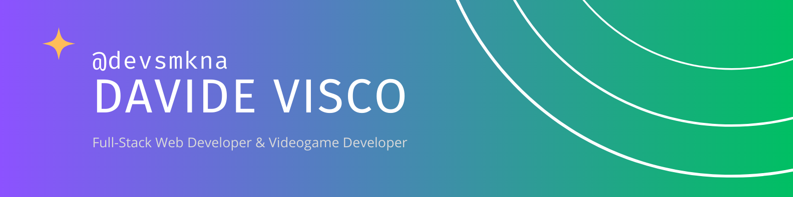

[](https://www.linkedin.com/in/viscod/)
[](https://t.me/deusmakina)
<!-- [](https://t.me/deusmakina) -->

### 👋 Hello there, I'm Davide

I am a full-stack web developer and videogame developer passionate about learning new things, experiment with new technologies and connect with nerdy people. I enjoy working with ReactJS, Typescript, Python and C#. I like to share the things I learn, so feel free to <a href="mailto:davidevisco@email.com?subject=Nice%20to%20meet%20you%20|%20devsmkna%20Github%20README">connect</a>.

### 💻 whoami

> “Shoot for the moon. Even if you miss, you'll land among the stars”
> 
> <cite>- Normal Vincent Peale</cite>

```typescript
const devsmkna: Developer = {
  name: 'Davide Visco',
  pronouns: 'he' | 'him',
  location: 'Catania, Italy',
  dateOfBirth: new Date(1998,03,19),
  languages: ['it_IT', 'en_US'],
  email: 'davidevisco@email.com',
  hobbies: ['videogames', 'books', 'writing', 'space']
}
```

### 🌱 Currently Working

[](https://github.com/devsmkna/bookshelf)

### 💬 Languages & Softwares
<div>


</div>
<!--
**devsmkna/devsmkna** is a ✨ _special_ ✨ repository because its `README.md` (this file) appears on your GitHub profile.

Here are some ideas to get you started:

- 🔭 I’m currently working on ...
- 🌱 I’m currently learning ...
- 👯 I’m looking to collaborate on ...
- 🤔 I’m looking for help with ...
- 💬 Ask me about ...
- 📫 How to reach me: ...
- 😄 Pronouns: ...
- ⚡ Fun fact: ...
-->
